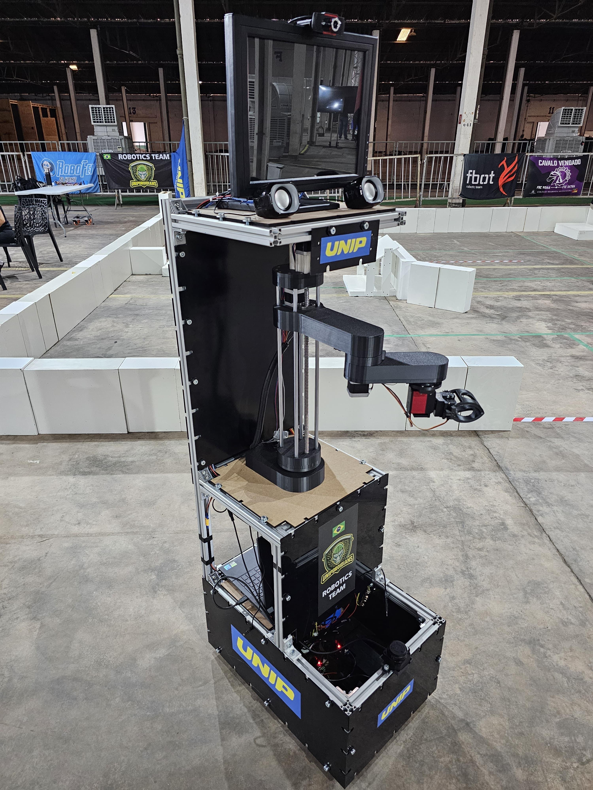

# UNIPDroidians  
**Robotics Research and Development Group – UNIP**  
🌐 Website: unipdroidians.com  

<p align="center">
  
  
</p>

---

## Abstract

**UNIPDroidians** is an academic robotics group from **Universidade Paulista (UNIP)** focused on the research, development, and integration of **autonomous domestic service robots**, with a primary emphasis on participation in the **RoboCup@Home** competition.

This repository serves as a centralized hub for **software artifacts, documentation, experimental code, and research prototypes**, covering areas such as autonomous navigation, perception, manipulation, human–robot interaction, and intelligent task execution.

---

## Research Objectives

The main objectives of the UNIPDroidians project include:

- Development of **autonomous mobile manipulation systems**
- Integration of **ROS 2-based robotic architectures**
- Research in **SLAM, localization, and navigation (Nav2)**
- Multimodal perception using **LiDAR, RGB-D cameras, and vision models**
- Application of **AI techniques** for domestic service tasks
- Preparation and validation of systems for **RoboCup@Home benchmarks**

---

## Scope and Features

Current and planned system capabilities include:

- Autonomous navigation using **ROS 2 Humble + Nav2**
- SLAM and localization with LiDAR-based perception
- Differential drive and mobile base control
- Manipulation using **6-DOF robotic arms**
- Human–robot interaction via voice and vision
- Offline and online AI modules for task reasoning

Future extensions may involve:

- Semantic mapping
- Multi-robot coordination
- Learning-based navigation and manipulation
- Benchmark-driven performance evaluation

---

## Repository Structure

The repository is organized following **ROS 2 and software engineering best practices**:

```text
unipdroidians/
├── src/        # ROS 2 nodes, drivers, control and perception modules
├── launch/     # ROS 2 launch files (navigation, SLAM, perception)
├── docs/       # Technical documentation, tutorials, and research notes
├── sim/        # Simulation environments (Gazebo, RViz)
├── imagens/    # Figures, diagrams, robot photos, and team images
└── README.md   # Project overview and documentation

System Requirements

    Ubuntu 22.04 LTS

    ROS 2 Humble Hawksbill

    Python ≥ 3.10

    Compatible LiDAR and camera sensors

    Hardware platform for differential-drive robots

All dependencies are specified within individual ROS 2 packages.
Methodology and Technical Approach

The project adopts a modular and reproducible architecture, enabling:

    Clear separation between perception, control, and decision layers

    Hardware abstraction through ROS interfaces

    Scalability for additional sensors and actuators

    Reusability in academic and competition contexts

The system design emphasizes open-source technologies, transparency, and experimental validation.
Academic and Educational Use

This repository may be used for:

    Undergraduate and graduate research projects

    Capstone projects and theses

    Robotics and AI laboratory courses

    RoboCup@Home training and benchmarking

Ethical Considerations

The development and deployment of autonomous robotic systems follow ethical principles such as:

    Responsible use of AI technologies

    Transparency of system limitations

    Safety-first design in human environments

Contribution Guidelines

Contributions are welcome from students and researchers.

    Fork this repository

    Create a feature branch (feature/your-feature-name)

    Commit changes with clear messages

    Open a Pull Request with proper documentation

Affiliation and Credits

Institution: Universidade Paulista (UNIP)
Research Group: UNIPDroidians – Robotics and Intelligent Systems
Focus Areas: Robotics, Artificial Intelligence, Autonomous Systems

This repository is intended exclusively for academic, educational, and research purposes.
License
